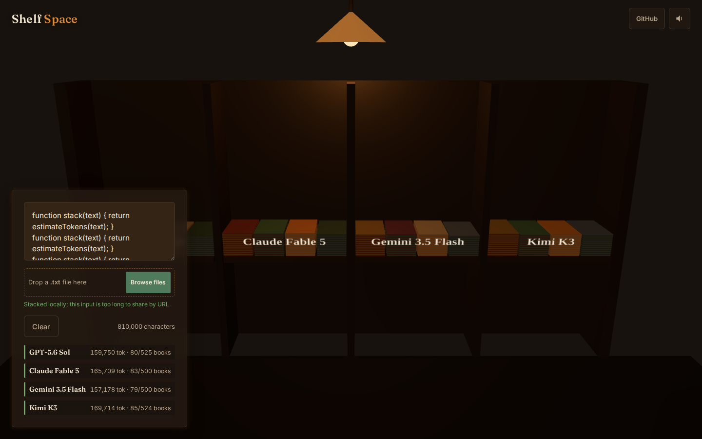

# Shelf Space

**▶ Live demo - [apps.charliekrug.com/shelf-space](https://apps.charliekrug.com/shelf-space/)**

[](https://github.com/ctkrug/shelf-space/actions/workflows/ci.yml)
[](LICENSE)

**See an LLM context window comparison as books.**

Shelf Space is a Three.js tool for developers deciding whether a large repository, manuscript, or
research corpus fits into one model request. Paste text and watch it become physical books across
four shelves. When an estimate exceeds a published input limit, the extra books move onto the
floor.



## What it compares

The current roster uses specific API models instead of broad product-family names:

| Model | Published context window | Shelf capacity |
|---|---:|---:|
| [GPT-5.6 Sol](https://developers.openai.com/api/docs/models/gpt-5.6-sol) | 1,050,000 tokens | 525 books |
| [Claude Fable 5](https://platform.claude.com/docs/en/about-claude/models/introducing-claude-fable-5-and-claude-mythos-5) | 1,000,000 tokens | 500 books |
| [Gemini 3.5 Flash](https://ai.google.dev/gemini-api/docs/whats-new-gemini-3.5) | 1,000,000 tokens | 500 books |
| [Kimi K3](https://www.kimi.com/resources/kimi-k3-pricing) | 1,048,576 tokens | 524 books |

Every rendered book represents 2,000 estimated tokens. The model limits above were checked on
July 21, 2026.

## What you can do

- **Compare your own source.** Paste prose or code and get four model-specific estimates in about
  120ms after typing stops.
- **Load text without a copy step.** Drop a `.txt`, `.md`, or Markdown file, or paste a public
  GitHub repository URL to flatten up to 80 supported text files.
- **Trace the visual back to text.** Click a shelf or floor book to inspect the exact character
  slice it represents.
- **Share a short comparison.** Compact inputs are encoded into the URL and restore on load. Long
  inputs remain local rather than producing an unreliable link.
- **Use it from a phone.** The 3D shelf, bottom sheet, orbit controls, focus states, and 44px touch
  targets are composed for 390px, 768px, and desktop widths.

## Use it

1. Open the [live app](https://apps.charliekrug.com/shelf-space/).
2. Paste text into the panel, drop a supported text file, or paste a public GitHub repository URL.
3. Read the estimated token and book totals beside each model.
4. Drag the shelf to change the camera angle. Scroll to zoom.
5. Click a book to inspect its source interval. Use the generated URL to share short inputs.

Example repository input:

```text
https://github.com/ctkrug/shelf-space
```

## Run locally

Requirements: Node.js 20.19 or newer and npm.

```bash
git clone https://github.com/ctkrug/shelf-space.git
cd shelf-space
npm ci
npm run dev
```

The development server prints its local URL. The app has no backend and needs no API keys.

## Verify a change

```bash
npm run lint
npm test
npm run test:coverage
npm run build
```

Coverage is enforced at 85% lines for `src/core`. CI runs lint, the full Vitest suite, and the
production build for every pull request to `main`.

## Accuracy and privacy

Token totals are local estimates based on character and word signals. They are useful for scale,
but they are not vendor billing counts and can differ for code, punctuation, multilingual text,
or a future tokenizer revision. A source fitting inside a context window also does not guarantee
perfect recall or leave enough room for the desired output.

Pasted files and text are processed in the browser. Public repository URLs are read through the
GitHub API. Share links contain base64url-encoded text, which is encoding rather than encryption,
so do not place sensitive material in a shared URL.

## Project map

- [`docs/POSITIONING.md`](docs/POSITIONING.md) defines the audience and copy system.
- [`docs/DESIGN.md`](docs/DESIGN.md) records the reading-room direction and visual tokens.
- [`docs/ARCHITECTURE.md`](docs/ARCHITECTURE.md) maps the data, render, UI, and audio boundaries.
- [`docs/BACKLOG.md`](docs/BACKLOG.md) records the completed acceptance criteria.

Released under the [MIT License](LICENSE).

More of Charlie's projects → https://apps.charliekrug.com
